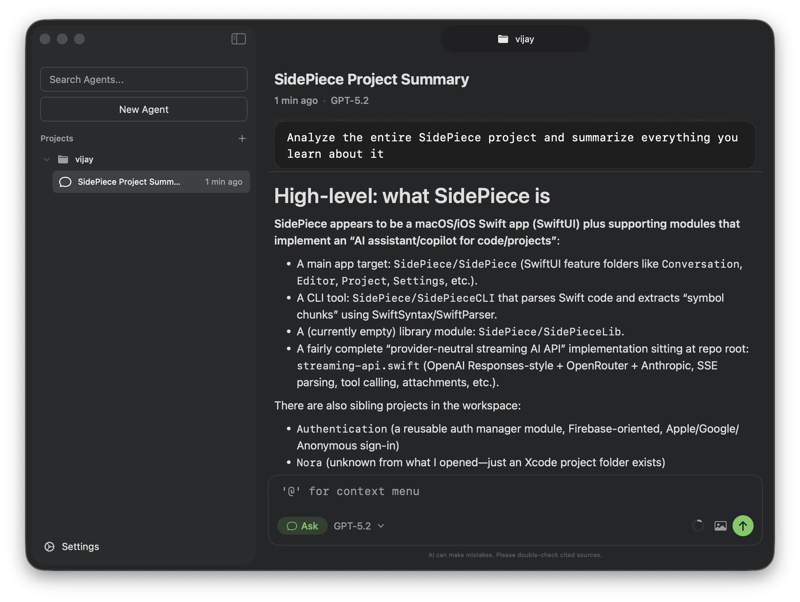

# SidePieceLib

**A production-ready Swift library for building AI coding assistant interfaces with multi-provider LLM streaming, type-safe agent tools, and a polished SwiftUI experience.**

SidePieceLib gives you everything you need to ship a native AI coding assistant on Apple platforms. It handles the hard parts — real-time LLM streaming, tool execution, conversation persistence, and project-aware context — so you can focus on building a great product.

<picture>
  <source media="(prefers-color-scheme: dark)" srcset="./sidepiecelib.png">
  
</picture>

---

## Why SidePieceLib

- **Multi-provider, one API.** Stream from OpenAI, Anthropic, and OpenRouter through a single, unified `AIProvider` protocol. Swap models or providers without changing your UI code.
- **Type-safe agent tools.** Define tools with strongly-typed Swift inputs and outputs. The framework handles all JSON schema generation, encoding, and decoding at compile time.
- **Built on The Composable Architecture.** State management, navigation, side effects, and testing are all structured and predictable. Every feature is a composable `Reducer` you can scope, combine, and test in isolation.
- **Real-time streaming, done right.** A purpose-built SSE parser and composable `StreamHooks` middleware give you full control over the request/response lifecycle — logging, recording, retry logic, and more — without touching provider internals.
- **Production UI included.** A complete, ready-to-use SwiftUI interface with conversation management, context overlays, inline attachments, model selection, keyboard shortcuts, and project navigation.

---

## Features

### Multi-Provider LLM Streaming

Connect to any OpenAI-compatible API, Anthropic's Messages API, or OpenRouter — all through one protocol. SidePieceLib normalizes streaming events across providers into a clean, provider-neutral event type:

```swift
public enum LLMStreamEvent: Sendable, Equatable {
    case textDelta(String)
    case toolCallStart(id: String, name: String)
    case toolCallDelta(id: String, args: String)
    case toolCallEnd(id: String, name: String, arguments: String)
    case reasoningDelta(String)
    case finished(usage: TokenUsage?, finishReason: FinishReason)
}
```

Extended thinking and reasoning traces are first-class citizens. Configure reasoning effort per request with `ReasoningEffort` to control cost and latency.

### Type-Safe Agent Tool System

Build tools that are impossible to wire up incorrectly. The `TypedTool` protocol enforces compile-time contracts between your tool's inputs, outputs, and JSON schema:

```swift
struct SearchTool: TypedTool {
    static let name = "search"
    static let description = "Search the project for matching content."

    func execute(_ input: SearchInput, projectURL: URL) async throws -> SearchOutput {
        // input.query and input.maxResults are already the right Swift types
        SearchOutput(results: ["..."], totalCount: 1)
    }
}
```

Snake-case JSON from the LLM maps automatically to camelCase Swift properties. No manual `CodingKeys`, no raw string parsing.

### Six Built-In Codebase Tools

Every agent ships with powerful, project-aware tools out of the box:

| Tool | What It Does |
|------|-------------|
| `read_file` | Read file contents with line numbers, or base64-encode images |
| `file_search` | Fuzzy filename search across the project |
| `glob_file_search` | Pattern-based file discovery (e.g. `**/*.swift`, `**/test_*.ts`) |
| `grep` | Regex search powered by ripgrep |
| `codebase_search` | Keyword-based code search with stop-word filtering |
| `list_dir` | Directory listing with configurable ignore patterns |

### Composable Stream Hooks

Intercept and transform every phase of the streaming lifecycle without subclassing or modifying provider code:

```swift
let logging = StreamHooks(
    willSendRequest: { request in print("→", request.url!); return request },
    didReceiveSSELine: { line in print("SSE:", line); return line },
    didComplete: { print("Stream complete") }
)

let recording = RecordingHooks.create(directory: recordingsDir)

let combined = logging.combined(with: recording)
```

Hooks compose cleanly — stack logging, recording, analytics, and retry logic in any order.

### Conversation Persistence

Conversations are automatically serialized to disk with full fidelity. The persistence layer handles:

- Conversation state snapshots via `ConversationDTO`
- Per-project conversation indexes for fast listing and pagination
- Load, save, delete, and paginated browsing through `ConversationStorageClient`

### Project-Aware Context System

The context overlay lets users attach files, folders, and tools to conversations using an `@`-mention interface — the same interaction pattern developers already know from modern code editors. An integrated project indexer keeps file search fast and up to date.

### Secure Settings and Key Management

API keys for OpenAI, Anthropic, and OpenRouter are stored in the macOS Keychain through a dedicated `KeychainClient`. User preferences are managed separately via `UserPreferencesClient`, keeping secrets out of plain-text config files.

### Full-Featured SwiftUI Interface

SidePieceLib includes a complete, polished UI layer:

- **Project sidebar** with multi-project navigation and recent project history
- **Conversation view** with streaming message rendering, reasoning blocks, and tool call visualization
- **Context overlay** for attaching files and tools with `@`-mention search
- **Model selection modal** with live model registry from models.dev
- **Inline attachments** rendered as VS Code-style chips in the input field
- **Image overlay** for full-screen image viewing
- **Keyboard shortcuts** — Shift+Tab to cycle agents, Escape to dismiss, Cmd+, for settings
- **Splash screen** and loading state while models and agents initialize

### Replay Provider for Testing and Demos

Record and replay LLM sessions with `ReplayProvider` and `RecordingHooks`. Ideal for building reliable previews, writing deterministic tests, and creating product demos without burning API credits.

---

## Architecture

SidePieceLib is built on [The Composable Architecture (TCA)](https://github.com/pointfreeco/swift-composable-architecture), giving you:

- **Predictable state management** — every feature is a `@Reducer` with explicit `State`, `Action`, and `Effect` types
- **Composable features** — nest and scope reducers freely: `ProjectFeature` → `ConversationFeature` → `MessagesFeature` → `MessageItemFeature`
- **Dependency injection** — all external concerns (networking, storage, keychain, indexing) are injected via `@Dependency` and fully replaceable in tests and previews
- **Swift 6 concurrency** — `Sendable` conformance throughout, actor-isolated networking, and structured concurrency with `AsyncThrowingStream`

### Dependency Clients

Every external concern is abstracted behind a testable client:

| Client | Responsibility |
|--------|---------------|
| `ModelClient` | Fetch and transform the model registry |
| `AgentClient` | Provide available agents and their tool sets |
| `ToolRegistryClient` | Register and execute tools by name |
| `ConversationStorageClient` | Persist and retrieve conversations |
| `ProjectIndexerClient` | Index project files for search |
| `KeychainClient` | Secure API key storage |
| `UserPreferencesClient` | User settings persistence |
| `MessageItemClient` | System prompt generation |
| `RecentProjectsClient` | Track and resolve recent projects |

---

## Requirements

- Swift 6.2+
- macOS (primary platform, with partial iOS font support)
- [The Composable Architecture](https://github.com/pointfreeco/swift-composable-architecture)
- [Textual](https://github.com/vijaysharm/textual) — rich attributed text rendering for SwiftUI

## Installation

Add SidePieceLib to your project using Swift Package Manager:

```swift
dependencies: [
    .package(url: "https://github.com/your-org/SidePieceLib.git", from: "1.0.0")
]
```

Then add `"SidePieceLib"` as a dependency of your target.

## Quick Start

```swift
import SidePieceLib
import SwiftUI

@main
struct MyApp: App {
    var body: some Scene {
        WindowGroup {
            SidePieceAppView(
                store: Store(initialState: .loading(LoadingFeature.State())) {
                    SidePieceAppFeature()
                }
            )
        }
    }
}
```

---

## License

See [LICENSE](LICENSE) for details.
